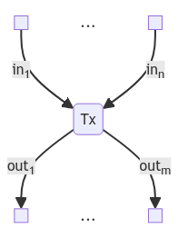

<div class="container-fluid main-container">

<div id="header">

</div>

<div style="text-align: center; font-family: Arial, sans-serif;">

# Smart Contracts in Cardano

**Claudio Hermida**  
<claudio.hermida@gmail.com>  
<https://www.linkedin.com/in/claudiohermida/>

</div>

<div id="abstract" class="section level2">

## Abstract

> The purpose of this note is to

> > - Show how the eUTxO model of blockchain comes about from a consideration of handling state in functional programming
> > - Exhibit Cardano’s validators as verifiable specifications of a contract-method input-output behaviour
> > - Provide a putative answer to the question: what is a smart contract in Cardano?

- [Part I: Functional programming and the eUTXO model](#part-i-functional-programming-and-the-eutxo-model)
  - [Functional programming](#functional-programming)
  - [Handling State](#handling-state)
  - [Distributed Ledger and Smart Contracts](#distributed-ledger-and-smart-contracts)
  - [Transactions](#transactions)
  - [Deploying contracts](#deploying-contracts)
- [Part II: Specification and validation](#part-ii-specification-and-validation)
  - [Specification in the small: methods, pre- and post-conditions](#specification-in-the-small-methods-pre--and-post-conditions)
  - [Specifying a transaction: validators](#specifying-a-transaction-validators)
    - [Validators and contract methods](#validators-and-contract-methods)
  - [Building Tx schema](#building-tx-schema)
  - [Smart Contracts in Cardano](#smart-contracts-in-cardano)
  - [Appendix: The State Monad](#appendix-the-state-monad)
- [References](#references)

</div>

<div id="part-i-functional-programming-and-the-eutxo-model" class="section level1">

# Part I: Functional programming and the eUTXO model

<div id="functional-programming" class="section level2">

## Functional programming

The prevailing programming paradigm is *object oriented programming*, a natural evolution of *imperative programming* incorporating encapsulation to support *data abstraction*. Imperative programming evolved from primitive assembly languages, closely tied to the hardware model of CPU and RAM: the machine memory is a large array of updatable locations, which store both data and program. The program is understood as a sequence of instructions which fetch data from memory, perform calculations and update *variables* (references to storage locations), plus any input/output required from external devices.

Functional programming \[<span class="citation">Thompson (2011)</span>\]<span class="citation">(Bird 2014)</span>, on the other hand, is a paradigm where programs are *functional expressions* transforming inputs into outputs. Such expressions are built composing predefined as well as user-defined functions, and evaluated by *term rewriting*, replacing an instance of the left-hand side of an equation by the corresponding instance of the right-hand side.

Ex: defining `succ` and `double` as

``` haskell
succ x = x + 1

double y = 2 * y
```

we may evaluate `double(succ 3)` as follows:

``` haskell
double ( succ 3) ~~> double( 3 + 1) ~~> double 4 ~~> 2 * 4 ~~> 8 
```

( innermost redex evaluation strategy: strict evaluation)

Or

``` haskell
double (succ 3) ~~> 2 * (succ 3) ~~> 2 * (3 + 1) ~~> 2 * 4 ~~> 8
```

(outermost redex evaluation strategy: lazy evaluation )

The two main characteristics of functional programming for our considerations of eUTXO modelling are

- ***Stateless***: functions are evaluated, reading inputs and producing outputs without manipulating any state or storage variables.

- ***Referentially transparent***: the main consequence of statelessness is that we can reason equationally with functional expressions, replacing equals by equals anywhere.

</div>

<div id="handling-state" class="section level2">

## Handling State

Modern functional languages like Haskell evolved from functional calculi, typically some variant of lambda calculus, used as metalanguages to express the denotational semantics of programming languages <span class="citation">(Tenent 2023)</span>, which gives meaning to programs as functions transforming input state into output state.

In imperative programming, a *storage location* or *variable* can be thought abstractly as an *object* on which we may perform two operations: `read` and `update` <span class="citation">(Reynolds 1981)</span>.

**Example:** Consider a `reverse` operation on lists using an *accumulator* to store the intermediate result of reversing the list as we go through it:

``` haskell
 reverse :: List A -> List A

 reverse l =
     let
        var accumulator:: List A
        reverseWithAccumulator :: List A -> List A
            reverseWithAccumulator EmptyList = accumulator -- read state
            reverseWithAccumulator a:l       = 
                    accumulator :=  a: accumulator;  -- update state
                    reverseWithAccumulator l
    in  
        accumulator := EmptyList;  -- initialize state
        reverseWithAccumulator l
```

In order to emulate the use of the storage variable in a stateless fashion we must emulate the two operations on it:

- To emulate `read` we must provide the contents of the variable as an additional input to the `reverse` function
- To emulate `update` we must produce the updated content as an additional output so that it can be used in later computation.

``` haskell
 newType State = List A

 reverse l = 
 let 
 reverseWithAccumulator' :: (List A,State) -> (List A, State)

 reverseWithAccumulator'(EmptyList,acc)  = (acc,acc) 
                        -- read state => no change on second component
 reverseWithAccumulator' (a:l, acc) = 
                                reverseWithAccumulator' (l, a:acc) 
                        -- update state => modify second component                 
                
    in  
        fst $ reverseWithAccumulator (l,EmptyList) 
        -- supply initial state, 
        -- select first component to get result 
```

In general, we have the following bidirectional translation:
$$\big[\mathsf{var\  s:State} \vdash \mathsf{f:I\longrightarrow O }\big] \Longleftrightarrow \big[\vdash \mathsf{f':(I,State)\longrightarrow(O,State)}\big]$$

which means that a function in the context/environment of a variable of type <span class="math inline">$\mathsf{State}$</span> can be represented by a function *in empty context* with extra input and output of type <span class="math inline">$\mathsf{State}$</span>.

</div>

<div id="distributed-ledger-and-smart-contracts" class="section level2">

## Distributed Ledger and Smart Contracts

In the account-based model of smart contracts on a blockchain (Ethereum), a distributed ledger is a collection of ***accounts*** (identified by an ***address***) with associated information, in particular a *balance* of assets or values held.

    Account-Ledger = Map Address Value

A ***smart contract*** is an *object* , in the sense of object-oriented programming. Therefore it has an internal *local state*, which includes the *balance*, and *methods*. A smart contract is *deployed* (held) at an (account) address in the ledger.

A ***transaction*** updates the distributed ledger by interacting with smart contracts and user held accounts, calling on their methods.

    tx-method : Account-Ledger -> Account-Ledger

<div style="border: 1px solid #999; padding: 10px; background-color: lightblue;">

### On formalism

We will not indulge in fully formal models of account-based or eutxo-based blockchains and related concepts like transactions, but give only indicative structures which add sufficient precision to our discussion without overloading the reader with details. A more elaborated formalisation of these notions appears in <span class="citation">(Brünjes and Gabbay 2020)</span> and a full-fledged Agda coding in <span class="citation">(Knispel et al. 2024)</span>.

</div>

<span id="vesting-contract">  
Example</span>: Here is a very simple vesting contract to illustrate concepts. A **benefactor** deposits a certain **amount** to be retrived by a specified **beneficiary**\*, once a certain **deadline** has been reached (say, when the beneficiary comes of age). Before the deadline, the benefactor may cancel the vesting and recover the deposited amount. A boolean flag **consumed** is used to prevent multiples withdrawals/retrievals.

``` java
// SPDX-License-Identifier: MIT
pragma solidity ^0.8.0;

contract VestingContract {
    address public beneficiary;
    address public benefactor;
    uint public amount;
    uint public deadline;
    bool public consumed;

    constructor(
        address _beneficiary,
        uint _deadline
    ) payable {
        beneficiary = _beneficiary;
        benefactor = msg.sender;
        amount = msg.value;
        deadline = _deadline;
        consumed = false;
    }


    function claim() public {
        require(msg.sender == beneficiary, "Only the beneficiary can call this function.");
        require(block.timestamp >= deadline, "Deadline has not passed yet.");
        require(!consumed, "Funds have already been released.");
        consumed = true;
        payable(beneficiary).transfer(amount);
    }

    function cancel() public {
        require(msg.sender == benefactor, "Only the benefactor can call this function.");
        require(block.timestamp < deadline, "Deadline has already passed.");
        require(!consumed, "Funds have already been released.");
        consumed = true;
        payable(benefactor).transfer(amount);
    }
}
```

How should we handle these statefull smart contracts in a stateless fashion? Answer: eutxo (extended unspent transaction output) <span class="citation">(Chakravarty et al. 2020)</span>; our *functional transactions* should have additional input/output to account for state.

As we mentioned, in blockchains, the state of an account, uniquely identified by an *address*, is conveniently split (conceptually) in two components: value/balance and local variables. In Satoshi Nakamoto’s original utxo model for Bitcoin, only value is considered. Cardano extends this by adding a ***datum*** to the utxo to account for the local state of a contract object. So an **eutxo** is a tuple consisiting of

| **eutxo =** |                                              |
|:------------|:---------------------------------------------|
| **address** | target address where the utxo is held/locked |
| **value**   | value locked in this utxo                    |
| **datum**   | local state                                  |

Notice that in the account-based model, an address has associated state, while here (a piece of) state points to an address.

Just like in Bitcoin, eutxos in Cardano are ***resources***: they are *produced* by a transaction (as outputs) and can be *consumed* or *spent* once, and only once, by another transaction (as inputs).

According to this reformulation, a single eutxo would suffice to account for both value and local state at an address, which we can see as the equivalent of an account. However, in line with Bitcoin’s utxos, Cardano allows multiple etuxos to be held at a single address, thereby effectively splitting or *sharding* the local state at an address. This sharding has great benefits for efficiency: a transaction can select very precisely those utxos which hold the piece of state of interest to consume, and transactions consuming different utxos can be computed/validated in parallel. We elaborate on transaction execution/validation later on.

Another major benefit of sharding state combined with the resource nature of eutxos is *non-interference*: an eutxo can only be used by a single transaction, so different transactions cannot operate over the same piece of state <span class="citation">(Brünjes and Gabbay 2020, Lemma 2.15)</span>. This ensures *predictability* of the outcome of transactions, in contrast to the account-based model with shared global state among transactions; a transaction in such model can never guarantee in which initial state it will be executed.

</div>

<div id="transactions" class="section level2">

## Transactions

In the account-based model, a transaction transforms the global state of the blockchain. A transaction executes a *contract call*, whereby we invoke a method of a contract with specific arguments and the current state of the blockchain (meaning all the accounts’ local states indexed by their addresses) as inputs, producing an updated global state as output. This execution is carried *on-chain* by all the nodes involved in the processing of the transaction for its eventual inclusion in a block.

The most radical difference of Cardano’s eUTXO model is its treatment of transactions: in Cardano

> **a transaction is computed off-chain and validated on-chain**

On-chain validation is the key feature of the Cardano blockchain. A **validator** is a predicate which will indicate whether an input eutxo can be consumed by the transaction; it has the following signature:

``` haskell
validator :: Datum -> Redeemer -> ScriptContext -> Bool
```

Here `Datum` is the datum in the input eutxo we are attempting to consume, `Redeemer` is the action/method whose execution we are validating and `ScriptContext` indicates both the purpose of the script to be executed (spending an input, minting tokens, staking, etc.) and the transaction context (its inputs, outputs, and signatures).

Recall that we are operating under the functional-programming paradigm, so the only *actual* input that we provide to a validator is the redeemer, which is the equivalent of a *method signature* (name and arguments). Datum is a piece of *local state* encoded in the input eutxo, while the script context is the piece of *global state* the transaction has access to; both datum and script context are supplied to the validator by the Cardano node processing the transaction.

Presently, there are two major kinds of input eutxos<span id="Note1"><sup>[(CIP-31)](#CIP31)</sup></span>:

1.  eutxos held at a PublicKeyHash (pkh) address: these are the values held at an addreess controlled by a private key, which is required in the signature to unlock/spend such eutxo.
2.  eutxos held at a *script address*: a script address is uniquely associated to a validator (via hashing) and it is controlled by it. In order to unlock such eutxo, a node evaluates the validator (with a supplied redeemer); if it succeeds, the eutxo may be spent.

If all inputs of a transaction validate successfully (either by validator or signature), such inputs are consumed and its outputs are added to the ledger. Otherwise, the trasaction *fails* and no changes occur in the ledger.

Let us elaborate the process of *building* and *executing* a transaction:

- we *build* a transaction by specifying its inputs (eutxos) and its would-be outputs (eutxos). Here, eutxos are treated as mere *data*, not resources, since we are off chain. We also indicate the signer of the transaction, which pays for the *transaction fees* (supplied as one of the inputs eutxo). In order to specify outputs, some computation might take place from the given inputs (method execution); this is the off-chain (pre)computation of a transaction. We produce a so-called *transaction body*,

- we *sign and submit* the transaction body for *validation*: each input held at a script triggers the execution of the corresponding validator and each input held at a pkh is signature-verified.

- if all inputs validate and the transaction satisfies preservation-of-values (that is, inputs and outputs are balanced), the transaction submission is *successful* and the ledger gets updated: inputs are spent (eliminated) and outputs are created (added). Otherwise, the transaction *fails* and has no effect on the ledger.

The eUTXO model lends itself to a very simple modelling<sup><span class="citation">(Brünjes and Gabbay 2020)</span></sup> of a distributed ledger: it is the set or collection of eutxos

     Ledger = { eutxo } 

The blockchain itself is nothing more than a sequence of transactions (grouped in blocks), such that the inputs of one transaction are outputs of transactions occurring earlier in the sequence.

    Blockchain = [block]
    block = {tx}

There is no structure associating utxos to a given address; that information has to be collected by inspecting the blockchain.

A transaction consumes its inputs and produces new outputs:

    tx :  Ledger  ~~~~~>   ( Ledger - inputs ) + outputs

Let us compare the salient aspects of transactions on both models:

| **Account based**                                                                                                                                                                                       |
|:--------------------------------------------------------------------------------------------------------------------------------------------------------------------------------------------------------|
| \- Transaction signed and submitted to a node                                                                                                                                                           |
| \- Changes to the ledger effected **on-chain** by means of state updates of the accounts involved in the transaction                                                                                    |
| \- Protected execution **on-chain**: if anything fails, it *reverts* to initial state of the ledger before transaction execution started, using a snapshot of the state taken at the start of execution |
| \- **Validation** mixed with **execution**, by means of **require** statements                                                                                                                          |
| \- Access to accounts during execution could be unrestricted (Ethereum) or restricted to pre-specified ones at transaction-build time (Algorand)                                                        |

| **eUTXO based**                                                                                                                   |
|:----------------------------------------------------------------------------------------------------------------------------------|
| \- Transaction signed and submitted to a node                                                                                     |
| \- Outputs of a transaction **precomputed off-chain;**                                                                            |
| \- (Inputs, Outputs) fed as transaction context to cardano-node at transaction-build time                                         |
| \- (Inputs, outputs) are subject to **validation** in the node (**on-chain**) before effecting a change on the distributed ledger |

<div style="border: 1px solid #999; padding: 10px; background-color: lightgrey;">

### <span id="CIP31">Reference input</span>

Since the Vasil hardfork, CIP-31 <span class="citation">(Peyton Jones 2021b)</span> was implemented allowing for a new kind of input: **reference input**. It allows transactions to simply treat some inputs as *read-only data* rather than *resources*: we can read their value and datum, but not modify them. That way we avoid the waste of compute in consuming and (re)producing a given utxo just to read its content. [↩︎](#Note1)

</div>

</div>

<div id="deploying-contracts" class="section level2">

## Deploying contracts

In account-based models, a smart contract is an ***object*** or ***instance*** of a class. Deploying a contract amounts to *creating* a new instance of the class and assigning it to an account address, which will hold the *local state* of that object/instance. The initial state is set upon deployment invoking the *constructor* method in the contract. We can actually deploy *several* instances of the same contract class, each residing at a different account address; such account addresses hold the respective local states of those instances.

The analogous operation of deploying a contract in Cardano involves two steps:

> 1.  Generate a ***script address*** that is going to hold the local state of the contract via UTXOs. It is generated by hashing the Plutus validator script.
> 2.  Perform a transaction with an output (utxo) trageted at the script address, encoding the *intial state* of the instance in its Value and Datum.

We refer to the process in the second step as *building a utxo*

We may also emulate the **declaration** of the contract code, which is a transaction that loads the code by itself on-chain (considered as a library of methods), as follows:

> Build a UTXO with the ***reference script***<span id="refscript"><sup>[CIP-33](#CIP33)</sup></span>, so that the ‘contract class’ is on-chain and we can refer to it whenever it is needed for execution (validation)

The reason for putting the code in a utxo is that the very simple model of ledger in Cardano, namely as a set or collection of utxos, implies that if we want to associate any information to an address, we must build a utxo targetted at that address, containing that info.

<div style="border: 1px solid #999; padding: 10px; background-color: lightgray;">

### Reference Script CIP-33

A reference-script utxo carries the code of the validator script in a special new field. It was also introduced by <span class="citation">Peyton Jones 2021c)</span> implemented in the Vasil hard-fork. It greatly simplifies the size of transactions which invoke this validator, as we can just refer to the given utxo rather than pass the whole piece of code each time we refer to it.[↩︎](#refscript)

</div>

  
In order to accommodate the possibility of several instances of the same contract coexising in the blockchain, we *mint an NFT* which is incorporated in the value of the initializing eutxo and passed along as we update contract state via new eutxos. This NFT uniquely identifies the instance; it is the actual counterpart of the *account address* of the contract object. For a good example of this use of NFTs see <span class="citation">(Brujnes 2023a)</span>.

<div style="border: 1px solid #999; padding: 10px; background-color: lightgray;">

### On NFT threat tokens

[https://developers.cardano.org/docs/smart-contracts](https://developers.cardano.org/docs/smart-contracts/)

> *Contract instances:* *When you have contracts designed to run in multiple steps, the UTXO that represents the current state of a specific instance/invocation of that script is something you need to be able to keep track of.* *There is no standard for how to do this as of now, but one way to accomplish this is to be to create a minting-policy that only allows minting of thread token NFTs to the script’s address, and then use the NFTs as thread-tokens by having the validator script enforce such NFTs be moved with each transaction.*
</div>

Here is a brief summary of related concepts in both blockchain models:

| Account based            | eUTXO Based                                                 |
|--------------------------|-------------------------------------------------------------|
| contract (class)         | validator script + [transaction schema](#transactionSchema) |
| contract (object)        | initial-state-eutxo \@ script address                       |
| contract account address | contract token (NFT)                                        |
| declaration              | reference script eutxo                                      |

</div>

</div>

<div id="part-ii-specification-and-validation" class="section level1">

# Part II: Specification and validation

</div>

<div id="specification-in-the-small-methods-pre--and-post-conditions" class="section level1">

# Specification in the small: methods, pre- and post-conditions

Consider a sorting function which orders a list of integers in increasing order:

`sortIncOrder: List(Int) -> List(Int)`

Beyond our intuitive understanding which we can illustrate with examples `sortIncOrder [8,2,5] == [2,5,8]`, how do we formally specify such a function? For starters, we want the output increasingly ordered

``` haskell
Ordered:: List(Int) -> Bool
Ordered [] = True
Ordered [n] = True
Ordered n:(m:l) = n \leq m && Ordered(m:l)

forall l:List(Int). Ordered(sortIncOrder(l))
```

That is not enough, otherwise simply returning the empty list would do. We also expect the output list to a be a rearrengement or *permutation* of the input list

``` haskell
isPermutation:: List(Int) -> List(Int) -> Bool

isPermutation []    []  = True

isPermutation (h:t) l = (h `elem` l) && isPermutation t (l \ h)

forall l: List(Int). isPermutation(l,sortIncOrder(l))
```

Now we have a sound *specification* of what a sorting function should do, regardless of its implementation (quick sort, bubble sort, etc.)

Consider a functional program (or a procedural program modelled as a function)

`f:I -> O`

Given an input `i: I` it produces (if it terminates) an output `fi: O`. In order to *specify* its expected (extensional) behaviour, we must indicate a couple of predicates, called *precondition* and *postcondition*. The *precondition* constraints what kind of inputs should the function expect, while the postcondition indicates how inputs and outputs should relate. The specification states \> *for every input that satisfies the precondition, it and the result satisfy the postcondition*

which is expressed in first-order logic as

> $$ \forall i\,\colon\,I\,.\,\,\mathsf{Pre}(i) \Longrightarrow \mathsf{Post}(i, fi)$$

<div id="examples" class="section level3">

### Examples

- For `sortIncOrder` we have no precondition as it should work for all lists, so we get

``` haskell
    Spec(sortIncOrder) = forall l:List(Int). isSorted(sortIncOrder(l)) && isPermutation(l,sortIncOrder(l))
```

- As another example consider the following piece from the ***Aiken stdlib*** <https://aiken-lang.github.io/stdlib/aiken/transaction/value.html> (we elaborate on Values later on<span id="noteValues"><sup>[Values](#Values)</sup></span>):

  `from_asset_list(xs: List<(PolicyId, List<(AssetName, Int)>)>) -> Value`

  Promote an arbitrary list of assets into a Value. This function fails if (***Precondition***):

  - there’s any duplicate amongst PolicyId; `nodup $ map fst xs`
  - there’s any duplicate amongst AssetName; `all $ map (nodup $ map fst) xs`
  - the AssetName aren’t sorted in ascending lexicographic order; `all (Ordered map fst)`
  - or any asset quantity is null. `none $ concat (map (map (\(assetName,qty) -> qty == 0)))`

  This function is meant to turn arbitrary user-defined Data into safe Value, while checking for internal invariants. The result should be the addition of the values represented by each individual entry `(PolicyId,AssetName,Int)`, which we write as `SingletonValue`. So, the ***Postcondition*** is:

  `from_asset_list (xs) == foldr <> mempty $ concat (map (\pid -> map (\(an,qty) -> SingletonValue(pid,an,qty)))`

The specification above is a *partial specification*, as it does not constrain the program behaviour when the precondition does not hold. However, in blockchains, we do know that when the precondition of a method call does not hold, the execution should revert; in other words, if the precondition does not hold, the specification is falsified. In summary, we want

``` haskell
Spec(f) =
    forall i:I. Pre(i) ==> Post(i,fi) &&  !Pre(i) ==> false
```

This is equivalent to the more concise

``` haskell
Spec(f) = forall i:I. Pre(i) && Post(i,fi)
```

</div>

<div id="specifying-a-transaction-validators" class="section level2">

## Specifying a transaction: validators

A transaction in Cardano is a function on **resource types**, which consumes inputs and produces outputs. Just like data types specifiy collections of elements on which one can perform certain operations (like arithmetic operations on intergers or floats), resource types (or *linear types*) specify collections of elements which, in addition to the operations we can perform on them, are **produced** and **consumed**. Once produced, they can be used ***only once*** (consumed).

Remember that in Cardano, `LEDGER = {eutxo}` and a transaction in Cardano is a function `tx: LEDGER → LEDGER` whose effect is

``` haskell
tx(L) = (L - {inputs tx}) + {outputs tx}
```

with `inputs tx` being a set of utxos and `outputs tx` a list of utxos, regarded as a set with their unique identifiers via their position in the output list of the transaction.

A transaction <span style="color:blue">tx</span>  must satfisfy its ***specification***:

> ***SPEC(tx) = validator***<sub>1</sub> (datum(in<sub>1</sub>), redeemer<sub>1</sub>, sc<sub>1</sub>) ∧ … ∧ validator<sub>n</sub>(datum(in<sub>n</sub>),redeemer<sub>n</sub>, sc<sub>n</sub>) ∧ Preservation-of-Value(sc)

where **sc**<sub>i</sub> is the script context associated to **in**<sub>i</sub> to unlock it, and

> ***Preservation-of-Value(scriptContext)*** = “sum of values of inputs plus value minted = sum of values of outpus plus tx fee”:

> ***Value(in***<sub>1</sub>) + … + Value(in<sub>n</sub>) + Value(forge(tx)) = Value(out<sub>1</sub>) + … + Value(out<sub>m</sub>) + Fee(tx)

or, in Plutus notation:

value (in<sub>1</sub>) \<\> … \<\> value(in<sub>n</sub>) \<\> txInfoMint == value’(out<sub>1</sub>) \<\> … \<\> value’(out<sub>m</sub>) \<\> txInfoFee

where  
value :: TxInInfo -\> Value  
value in = txOutValue \$ txInInfoResolved in

value’:: TxOut -\> Value  
value’ = txOutValue

<div style="border: 1px solid #999; padding: 10px; background-color: lightgray;">

### <span id="Values">Value</span>

In Cardano, the type **Value** amounts to a bag of assets

    Value = Bag(AssetClass)

    AssetClass = {unAssetClass :: (CurrencySymbol, TokenName)}

This is **not** the definition of Value in the Plutus repository, but merely its abstract algebraic characterisation. The Value type is implemented via nested maps (as outlined in our second [example](#noteValues) , which shows additional constraints imposed on such maps to be considered values).

A bag (also called a *multiset*) is a list where ‘order does not matter’; all that matters is the number of occurrences or repetitions of an element in the bag. Just like, for a given set A, List(A) is the *free monoid* on A, Bag(A) is the *free commutative monoid* on A; it is crucial for the above formula of preservation of value that the operation \<\> be commutative as well as associative.[↩︎](#noteValues)

</div>

<div id="validators-and-contract-methods" class="section level3">

### Validators and contract methods

How are we to use validators in the context of implementing smart contracts? The answer is:

> ***A validator specifies the pre- and post-condition of a contract method***

Let us illustrate this with our running example of a vesting contract. Consider the method `claim()`: we deduce from it a `Validator (dat,Claim,ctx)` and a *transaction schema*<sup>[](@transactionSchema)</sup> which gets instantiated into a concrete transaction to submit to the blockchain once we fill in its required inputs and compute its outputs:


 
Here is the full Haskell code for the validators of our smart contract:

``` haskell
data VestingDatum = VestingDatum
    { beneficiary :: PubKeyHash
    , benefactor: PubKeyHash
    , deadline    :: POSIXTime
    , amount: Integer
    }

unstableMakeIsData ''VestingDatum

data VestingRedeemer = Claim | Cancel

unstableMakeIsData "VestingRedeemer

{-# INLINABLE mkVestingValidator #-}

mkVestingValidator :: VestingDatum -> VestingRedeemer -> ScriptContext -> Bool
mkVestingValidator dat Claim ctx =
    let
    -- PRECONDITIONS
        signedByBeneficiary = txSignedBy info $ beneficiary dat
        deadlineReached = contains (from $ deadline dat) $ txInfoValidRange info
    -- POSTCONDITION
        amountPaidToBeneficiary = ( (getSignerAdaAmount info beneficiary) == amount dat)

    in
        traceIfFalse "beneficiary's signature missing" signedByBeneficiary &&
        traceIfFalse "deadline not reached" deadlineReached &&
        traceIfFalse "wrong amount paid" amountPaidToBeneficiary 
  where
    info :: TxInfo
    info = scriptContextTxInfo ctx

  -- extract the integer denominator (lovelace) of the Ada value of the outputs sent to a given address:
    getSignerAdaAmount :: TxInfo -> PubKeyHash ->Integer
    getSignerAdaAmount info addr = valueOf (valuePaidTo info addr) adaSymbol adaToken


mkVestingValidator dat Cancel ctx =
    let
    -- PRECONDITIONS
        signedByCreator = txSignedBy info $ from $ scriptContextTxInfo ctx
         deadlineNotReached = contains (to $ deadline dat) $ txInfoValidRange info
    -- POSTCONDITION
        amountPaidToBenefactor = ( (getSignerAdaAmount info benefactor) == amt)
    in
        traceIfFalse "creator's signature missing" signedByCreator &&
        traceIfFalse "deadline reached" deadlineNotReached &&
 traceIfFalse "wrong amount paid" amountPaidToBenefactor 
  where
    info :: TxInfo
    info = scriptContextTxInfo ctx   
```

A few differences are worthy of notice between the formulation of requirements/preconditions in both models:

- In the account-based model, since the contract methods operate on the whole state of the contract, we must use a boolean flag `consumed` to indicate whether the portion of the contract balance which is vested has already been consumed or not. This effectively turns that portion of the balance (state) into a *resource managed by the flag*: it is turned off when created and turned on when consumed or spent. In the validators, the resource-nature of eutxos makes this flag unnecessary: an input eutxo is either available or not, the node validating a transaction checks that for us.

- Conversely, we might notice that in the account-based model, the transfer of `amount` to `beneficiary/benefactor` is achieved by invoking a system-defined method `payable(beneficiary).transfer(amount)` which has its own (prespecified) pre and postconditions: ***pre*** is simply that `this.balance() >= amount` (sufficient funds available) and ***post*** is

``` javascript
 this.balance()after == this.balance()before - amount && 
 beneficiary.balance()after == beneficiary.balance()before + amount
```

The validator, on the other hand, cannot know whether the funds unlocked will satisfy the transfer postcondition; we only know that the value in the input will be consumed, but we must ensure that it reaches the beneficiary/benefactor, hence the additional check `amountPaidToBeneficiary` or `amountPaidToBenefactor` respectively.

</div>

</div>

<div id="building-tx-schema" class="section level2">

## Building Tx schema

Having set up validators for our methods, we must produce transactions to execute them. There are various frameworks for transaction building: MeshJS (<https://meshjs.dev/>) caters to JavaScript enthusiasts, offering React integration, while Atlas (<https://atlas-app.io/>) favors the more Cardano-native Haskell environment. In keeping with our functional programming emphasis we will use this latter as reference, although the concepts we expose are framework agnostic.

One attractive feature of Atlas is that it provides a modular way of building transactions, piece by piece so to speak: add an input, an output, a validity range, a signatory, etc. All these pieces are called *skeletons*: they live in a `GYTxSkeleton` monad with a monoid structure to combine such pieces via `<>`. A skeleton is fed to a *transaction builder*, like `gyTxBuilder` in `GYTxMonadNode`, along with relevant parameters for interacting with a node, such as network id and data providers. Such a transaction builder will attempt to complete the transaction body using a coin selection algorithm to select relevant fee and collateral input eutxos, and well as balancing the transaction by sending unspent input value to a change address.

<span id="transactionSchema">We call **transaction schema** any function that produces a transaction body `TxBody` as output, that is</span>[↩︎](#quoteTS)

> ***Transaction Schema = parameterized Transaction Body***
>
> So a composition of transaction builder with transaction-skeleton constructors would form such a schema. In the Atlas framework, a transaction body has type `GYTxBody`.

Let us see the relevant transaction schemas for our example Vesting contract (we use *inline datums*<sup><span class="citation">(Peyton Jones 2021a)</span></sup>):

``` haskell
-- set up initial state to deploy Vesting contract
placeVesting :: GYTxQueryMonad m => GYPubKeyHash -> GYPubKeyHash -> GYTime -> GYValue -> m (GYTxSkeleton 'PlutusV2)
placeVesting benefactor beneficiary deadline valueAmount = 
    return $ mustHaveOutput $ GYTxOut       --specify an eutxo with inline datum
        { gyTxOutAddress = vestingAddress
        , gyTxOutValue   = valueAmount
         , gyTxOutDatum   = Just (datumFromPlutusData $ 
                              VestingDatum benefactor beneficiary 
                                           {timeToPlutus deadline) (toLovelace $ fromValue valueAmount)
                            , GYTxOutUseInlineDatum)
        , gyTxOutRefS    = Nothing
        }


-- implement business logic of Claim method
claimVestingBeneficiary :: GYTxQueryMonad m => GYPubKeyHash -> GYTxOutRef -> m (GYTxSkeleton 'PlutusV2)
claimVestingBeneficiary beneficiary oref  = do
    slot <- currentSlot
    return $ isInvalidBefore slot <>                        -- sets up the validity interval
             mustBeSignedBy beneficiary <>                  -- adds a required signatory
             mustHaveInput GYTxIn                           -- adds input
                { gyTxInTxOutRef = oref
                , gyTxInWitness  = GYTxInWitnessScript      -- specify parameters to consume input eutxo: 
                    (GYInScript $ vestingValidatorScript)   -- script
                    Nothing                                 -- inline datum
                    Claim                                   -- redeemer
                } <>
             mustHaveOutput $ GYTxOut                        -- adds output
                { gyTxOutAddress = beneficiary               -- target address
                , gyTxOutValue   = getValueFromTxOutRef oref -- amount to transfer
                , gyTxOutDatum   = Nothing                   -- no datum
                , gyTxOutRefS    = Nothing                   -- no reference script
                }
       

-- Helper function to get the GYValue from a GYTxInTxOutRef
getValueFromTxOutRef :: GYTxQueryMonad m => GYTxInTxOutRef -> m (Maybe GYValue)
getValueFromTxOutRef txOutRef = do
    -- Query the UTxO
    utxo <- gyQueryUtxoAtTxOutRef txOutRef
    -- Extract the GYValue
    return $ fmap gyTxOutValue utxo


-- implement business logic of Cancel method
cancelVestingBenefactor :: GYTxQueryMonad m => GYPubKeyHash -> GYTxOutRef -> m (GYTxSkeleton 'PlutusV2)
cancelVesting benefactor oref  = do
    slot <- currentSlot
    return $ isInvalidAfter slot <>                           -- sets up the validity interval
             mustBeSignedBy benefactor <>                     -- adds a required signatory
             mustHaveInput GYTxIn                             -- adds input ... similar to claimVestingBeneficiary
                { gyTxInTxOutRef = oref
                , gyTxInWitness  = GYTxInWitnessScript
                    (GYInScript $ vestingValidatorScript)
                    Nothing 
                    Cancel
                } <>
             mustHaveOutput $ GYTxOut                          -- adds output ... similar to claimVestingBeneficiary
                { gyTxOutAddress = benefactor
                , gyTxOutValue   = getValueFromTxOutRef oref
                , gyTxOutDatum   = Nothing
                , gyTxOutRefS    = Nothing
                }
        

-- Wrapping the typed validator to an untyped version
mkUntypedVestingValidator :: BuiltinData -> BuiltinData -> BuiltinData -> ()
mkUntypedVestingValidator d r ctx =
    check (mkVestingValidator (unsafeFromBuiltinData d) (unsafeFromBuiltinData r) (unsafeFromBuiltinData ctx))

-- Compile the untyped validator to a Plutus Validator
vestingValidator :: Validator
vestingValidator = mkValidatorScript $$(PlutusTx.compile [|| mkUntypedVestingValidator ||])

-- Create a wrapped version to use within GeniusYield
vestingAddress :: GYAddress
vestingAddress = scriptAddress vestingValidator
```

Lastly, we have to build transaction bodies out of the skeletons, sign and submit. Here are the essential details (for the full-fledged version see <span class="citation">(Brujnes 2023b)</span>)

``` haskell
-- build initial transaction to deploy contract
-- we omit minting NFT contract token for simplicity:


...
    txBody <- runGYTxMonadNode networkId providers sender collateral $ 
        placeVesting
            benefactor beneficiary (timeFromPlutus deadline) 
            (valueFromLovelace $ toInteger amount)
    tid    <- gySubmitTx providers $ signTx txBody [skey]
...
 
-- build transaction to Claim vested amount:

    txBody <- runGYTxMonadNode networkId providers beneficiary collateral $ 
        claimVestingBeneficiary beneficiary oref
    tid     <- gySubmitTx providers $ signTx txBody [skey]
```

</div>

<div id="smart-contracts-in-cardano" class="section level2">

## Smart Contracts in Cardano

We could sum up our considerations of Cardano smart contracts with the slogan

> > ***A Cardano smart contract is a set of transaction schemas and their associated validators***

We have already established how such a set of schemas and validators must ‘share’ the data types `Datum` and `Redeemer`, in formulations compatible with the off-chain and on-chain setups, which might involve different languages. Essentially, `Datum` is a *product* of the various components of local state of the contract (besides its `Value`):

<div style="border: 1px solid #999; padding: 10px; background-color: lightgray;">

data Datum = Datum { var<sub>1</sub> :: Type<sub>1</sub> , var<sub>2</sub> :: Type<sub>2</sub> , … , var<sub>n</sub> :: Type<sub>n</sub> }

</div>

while `Redeemer` is a *sum* type, whose various alternatives correspond essentially to the methods signatures:

<div style="border: 1px solid #999; padding: 10px; background-color: lightgray;">

data Redeemer = Method<sub>1</sub> Type<sub>11</sub> … Type<sub>1p</sub> – … \| Method<sub>m</sub> Type<sub>m1</sub> … Type<sub>mq</sub>

</div>

The correspondence of “methods” to redeemer cases need not be 1-1: some methods interact with various ‘pieces of state’ which will be represented by several inputs, each to be consumed by a possibly different redeemer. And conversely, a complex transaction involving several inputs implements a business logic that may correspond to a combination of several “methods” in the OOP sense.

</div>

<div id="appendix-the-state-monad" class="section level2">

## Appendix: The State Monad

Our treatment of state in functional programming has focused on the traditional and widespread technique of having an additional input/output parameter. Functional programmers familiar with Haskell know of its ubiquitous use of *monads* to encapsulate operations on types and provide a systematic composition of the associated *monadic computations*. In particular, there is a “famous” **State** monad.

Let us recall the 1-1 correspondence between functions that take a pair as argument and functions with “two arguments”:

<span class="math display">$$\big[ \mathsf{(A \times B) \longrightarrow C} \big] \Longleftrightarrow \big[\mathsf{A \longrightarrow (B \longrightarrow C)}\big]$$</span> given by the functions

        curry :: ((A,B) -> C) -> (A -> (B -> C))
        curry f = \a -> (\b -> f (a,b))

        uncurry:: (A -> (B -> C)) -> ((A,B) -> C)
        uncurry g = \(a,b) -> g a b

which satisfy

        curry $ uncurry g == g
        uncurry $ curry f == f

Such a correspondence is called a (*natural*) *isomorphism*. Let us apply this correspondence to a function which manipulates a state `S`

    f:: (I,S) -> (O,S)  ~~~~~> curry(f):: I -> (S -> (O,S))

The expression `S -> (O,S)` is precisely the so-called *State monad* at the type `O`.

    State:: * -> *
    State a :: S -> (a,S)

> <strong><em>A function</em></strong> $\mathsf{f \,:\, I \longrightarrow O}$ <strong><em>with state</em></strong> $\mathsf{S}$ <strong><em>corresponds to a monadic computation</em></strong> $\mathsf{curry(f)\,:\, I \longrightarrow State\, O}$</strong></em>

</div>

</div>

<div id="references" class="section level1 unnumbered">

# References

<div id="refs" class="references csl-bib-body hanging-indent" entry-spacing="0">

<div id="ref-bird2014thinking" class="csl-entry">

Bird, Richard. 2014. *Thinking Functionally with Haskell*. Cambridge University Press.

</div>

<div id="ref-bruines2023oracle" class="csl-entry">

Brujnes, Lars. 2023a. “Stablecoin with Oracle.” <https://github.com/input-output-hk/plutus-pioneer-program/tree/fourth-iteration/code/Week09>.

</div>

<div id="ref-brujnes2023vestingApp" class="csl-entry">

———. 2023b. “Vesting App.” <https://github.com/brunjlar/atlas-examples/tree/main/vesting/app>.

</div>

<div id="ref-brunjes2020utxo" class="csl-entry">

Brünjes, Lars, and Murdoch J Gabbay. 2020. “UTxO-Vs Account-Based Smart Contract Blockchain Programming Paradigms.” In *Leveraging Applications of Formal Methods, Verification and Validation: Applications: 9th International Symposium on Leveraging Applications of Formal Methods, ISoLA 2020, Rhodes, Greece, October 20–30, 2020, Proceedings, Part III 9*, 73–88. Springer.

</div>

<div id="ref-chakravarty2020extended" class="csl-entry">

Chakravarty, Manuel MT, James Chapman, Kenneth MacKenzie, Orestis Melkonian, Michael Peyton Jones, and Philip Wadler. 2020. “The Extended UTXO Model.” In *Financial Cryptography and Data Security: FC 2020 International Workshops, AsiaUSEC, CoDeFi, VOTING, and WTSC, Kota Kinabalu, Malaysia, February 14, 2020, Revised Selected Papers 24*, 525–39. Springer.

</div>

<div id="ref-knispel2024formal" class="csl-entry">

Knispel, Andre, Orestis Melkonian, James Chapman, Alasdair Hill, Joosep Jääger, William DeMeo, and Ulf Norell. 2024. “Formal Specification of the Cardano Blockchain Ledger, Mechanized in Agda.” In *FMBC 2024*. <https://iohk.io/en/research/library/papers/formal-specification-of-the-cardano-blockchain-ledger-mechanized-in-agda/>.

</div>

<div id="ref-cip-32" class="csl-entry">

Peyton Jones, Michael. 2021a. “Inline Datums.” <https://cips.cardano.org/cip/CIP-32/>.

</div>

<div id="ref-cip-31" class="csl-entry">

———. 2021b. “Reference Inputs.” <https://cips.cardano.org/cip/CIP-31/>.

</div>

<div id="ref-cip-33" class="csl-entry">

———. 2021c. “Reference Scripts.” <https://cips.cardano.org/cip/CIP-33/>.

</div>

<div id="ref-reynolds1981craft" class="csl-entry">

Reynolds, John C. 1981. *The Craft of Programming*. Englewood Cliffs, NJ: Prentice-Hall International.

</div>

<div id="ref-tenent2023denotational" class="csl-entry">

Tenent, Robert. 2023. “Denotational Semantics.” In *Handbook of Logic in Computer Science*, edited by S. Abramsky Dov M. Gabbay and T. S. E. Maibaum. Oxford University Press. <https://academic.oup.com/book/52970/chapter/421961871>.

</div>

<div id="ref-thompson2011haskell" class="csl-entry">

Thompson, Simon. 2011. *Haskell: The Craft of Functional Programming*. Addison-Wesley.

</div>

</div>

</div>

</div>

</div>
